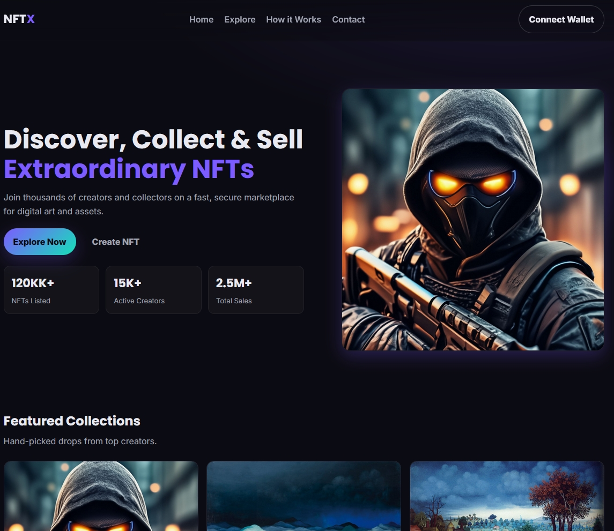

# 🎨 NFT Marketplace Landing (Demo)

Adaptive, responsive landing page for a fictional NFT marketplace.  
Built with **HTML5**, **CSS3**, and **JavaScript** — clean UI, smooth animations, conversion‑oriented UX.



## 🌐 Demo
https://dexhtml.github.io/nft-landing-demo/

## ✨ Features
- ⚡ **Hero with stats** — animated counters on scroll
- 🖼️ **Featured collections** — grid with hover effects
- 🧭 **Smooth navigation** — sticky header, smooth scroll
- 🧩 **How it works** — clear 3‑step onboarding
- 📱 **Responsive** — mobile, tablet, desktop

## 🛠 Tech Stack
- HTML5, CSS3 (Grid/Flex), Vanilla JS (IntersectionObserver, counters)
- GitHub Pages for hosting

## 📂 Project Structure
```plaintext
nft-landing-demo/
├── index.html
├── css/
│   └── style.css
├── js/
│   └── script.js
└── images/
    ├── nft-1.jpg … nft-6.jpg
    └── logo.svg (optional)
```
## 🚀 How to Run Locally
1. **Clone the repository**:
   ```bash
   git clone https://github.com/DexHTML/nft-landing-demo.git
   ```
2. **Open the project folder**:
   ```bash
   cd nft-landing-demo
   ```
3. **Run locally** — просто открой `index.html` в браузере.

   ## 👨‍💻 Author
**Vyacheslav (DexHTML)** — Frontend Developer specializing in crypto landing pages, UX animations, and conversion optimization.  
📧 Contact: [Telegram](https://t.me/Slaffkamak) | [Email](mailto:immun1986@gmail.com)

---
## 📜 License
This project is licensed under the [MIT License](LICENSE).

You are free to use, copy, modify, merge, publish, distribute, sublicense, and/or sell copies of the Software,  
provided that the original license notice and this permission notice are included in all copies or substantial portions of the Software.
