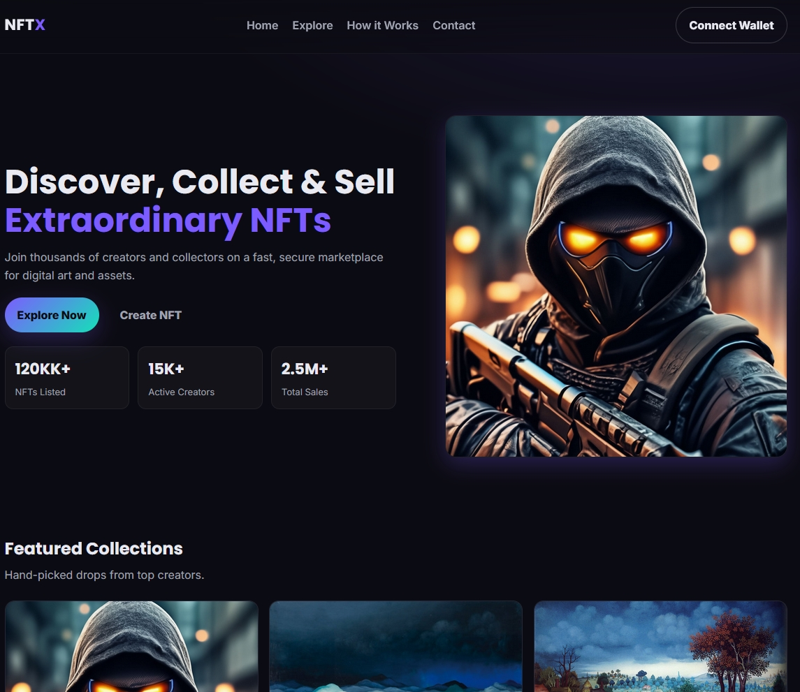

# NFT Landing Demo

## AI-assisted landing page experiment

NFT Landing Demo — адаптивный статический лендинг для вымышленного marketplace-проекта.

Проект создан как эксперимент с визуальной подачей, карточками коллекций, анимациями, адаптивной сеткой и публикацией через GitHub Pages.



---

## Demo

https://dexhtml.github.io/nft-landing-demo/

---

## Что проверялось

- hero-блок со статистикой;
- анимированные счётчики;
- карточки с hover-эффектами;
- sticky header и плавная навигация;
- блок “How it works”;
- адаптивная сетка для разных экранов;
- GitHub Pages как способ быстрой публикации.

---

## Стек

- HTML5;
- CSS3 Grid / Flexbox;
- Vanilla JavaScript;
- IntersectionObserver;
- GitHub Pages.

---

## Структура

```plaintext
nft-landing-demo/
├── index.html
├── css/
│   └── style.css
├── js/
│   └── script.js
└── images/
    └── nft-1.jpg … nft-6.jpg
```

---

## Статус

**Experimental / demo project**

Этот репозиторий не является основным направлением профиля. Он оставлен как часть архива экспериментов с лендингами, визуальной подачей, анимациями и GitHub Pages.

Основной фокус профиля сейчас — внутренние цифровые инструменты, сервисные системы, учёт техники, заявки, графики и AI-assisted проекты.
